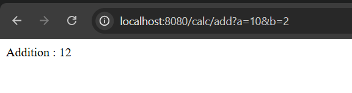
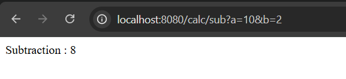
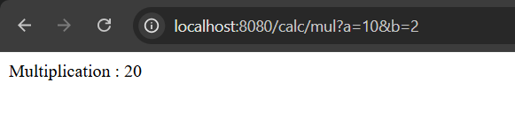
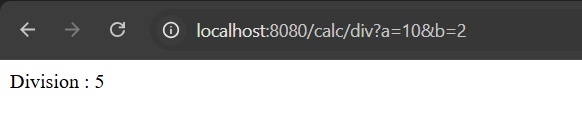

# Calculator Using Services – Spring Boot

A simple Spring Boot REST application that performs basic arithmetic operations using a clean Service–Controller architecture.

This project demonstrates:
- Spring Boot fundamentals
- Separation of concerns (Controller vs Service)
- Dependency Injection
- Maven-based Spring Boot application
- Building a basic backend REST API

---

## Features

- Addition
- Subtraction
- Multiplication
- Division
- REST APIs using Spring Web

---

## API Endpoints

Add  
/calc/add?a=10&b=5

Subtract  
/calc/sub?a=10&b=5

Multiply  
/calc/mul?a=10&b=5

Divide  
/calc/div?a=10&b=5

Note: URLs are case-sensitive. Use lowercase paths.

---

## Screenshots

Addition  

Subtraction  

Multiplication  

Division  

---

## Key Learnings

- Controller layer handles HTTP requests and responses
- Service layer contains only business logic
- Spring manages object creation and dependency injection
- Separation of concerns improves maintainability
- Clean backend structure using Spring Boot

---

## Author

Sujal Patil  
Email: sujalbpatil21@gmail.com  
GitHub: https://github.com/SujalPatil21

---

## Status

Completed  
Spring Boot REST API  
Service–Controller separation implemented  
Foundation backend project
