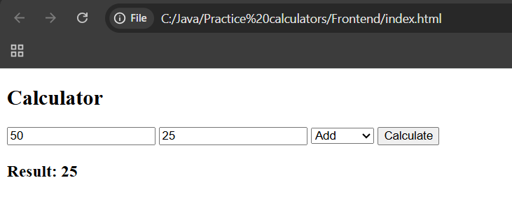
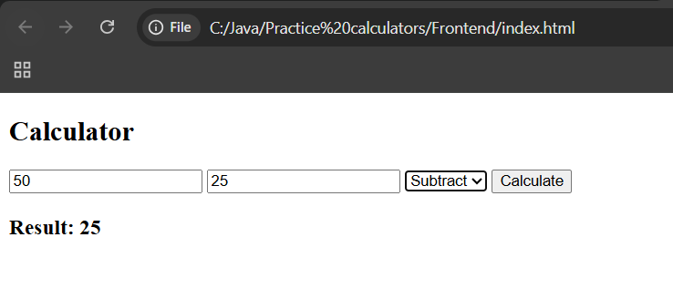
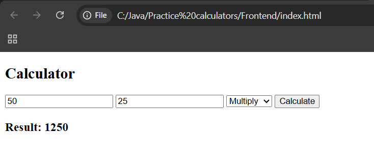
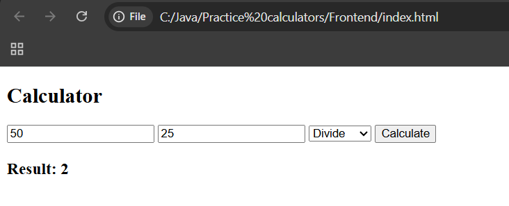

# Calculator With UI – Spring Boot & Frontend Integration

A simple full-stack calculator application built using Spring Boot for backend services and HTML, CSS, and JavaScript for the frontend user interface.

This project demonstrates:
- Spring Boot REST API development
- Service–Controller architecture
- Dependency Injection
- Frontend–Backend integration using Fetch API
- Building a complete client-server workflow

---

## Features

- Addition
- Subtraction
- Multiplication
- Division
- Interactive web-based UI
- Backend processing using Spring Boot REST API

---

## Application Flow

- User enters numbers and selects an operation in the UI  
- Frontend sends a request to Spring Boot backend  
- Backend processes the request using service layer  
- Result is returned and displayed on the UI  

---

## Screenshots

Addition  

Subtraction  

Multiplication  

Division  

---

## Key Learnings

- Frontend communicates with backend using HTTP (Fetch API)
- Controller layer handles API requests
- Service layer contains business logic
- Spring manages dependency injection
- Clean separation between frontend and backend
- Real-world client-server architecture

---

## Author

Sujal Patil  
Email: sujalbpatil21@gmail.com  
GitHub: https://github.com/SujalPatil21

---

## Status

Completed  
Spring Boot REST Backend  
Frontend Integration Implemented  
Service–Controller Architecture  

