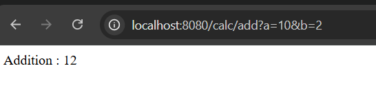
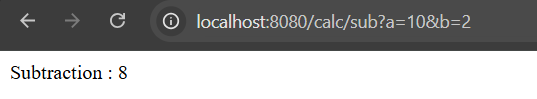
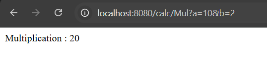
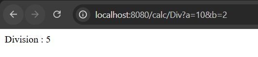

# Spring Boot Calculator REST API

A simple REST-based calculator application built using Spring Boot.  
This project exposes basic arithmetic operations as HTTP endpoints and demonstrates core backend concepts like request mapping and query parameter handling.

---

## 🚀 Features

- Addition
- Subtraction
- Multiplication
- Division
- REST API only (no UI, no console input)

---

## 🛠 Tech Stack

- Java 21
- Spring Boot
- Maven
- Embedded Tomcat

---

## ▶️ How to Run the Application

1. Open the project in IntelliJ IDEA
2. Locate `ProjectApplication.java`
3. Right-click → **Run ProjectApplication**
4. Ensure the server starts successfully on port `8080`

---

## 🌐 API Endpoints

- `/calc/add`
- `/calc/sub`
- `/calc/Mul`
- `/calc/Div`

All endpoints accept two query parameters:
- `a`
- `b`

---

## 📸 Screenshots

  
  
  

---

## 🧠 Concepts Used

- REST API
- `@RestController`
- `@GetMapping`
- `@RequestParam`
- HTTP Request–Response lifecycle

---

## ⚠️ Notes

- Endpoints are case-sensitive
- Division by zero is not handled
- This is a backend-only application

---

## 👨‍💻 Author

**Sujal Patil**  
🌐 GitHub: [SujalPatil21](https://github.com/SujalPatil21)  
📧 Email: sujalpatil21@gmail.com

