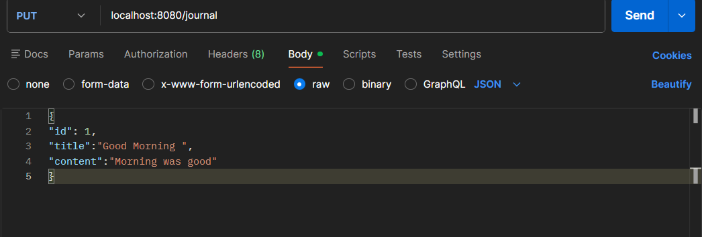
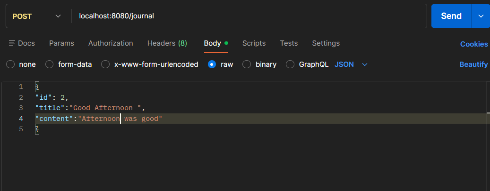
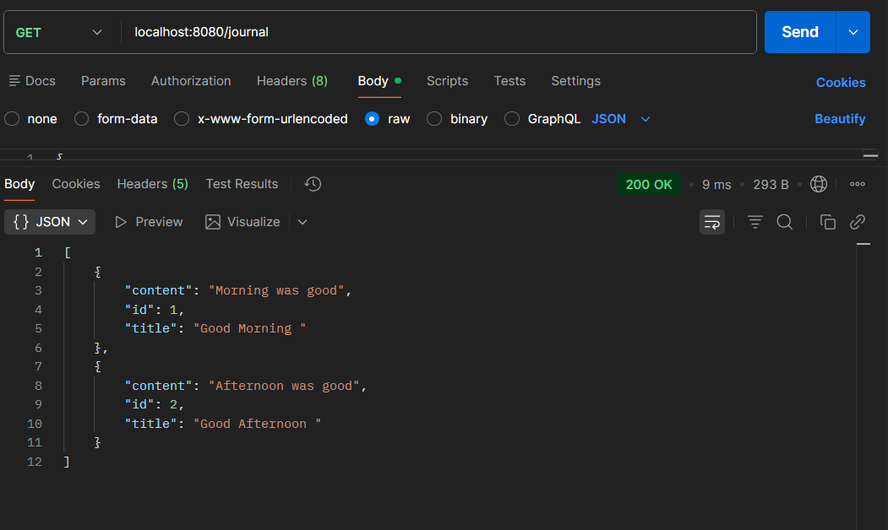
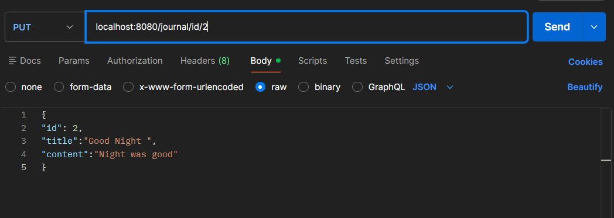
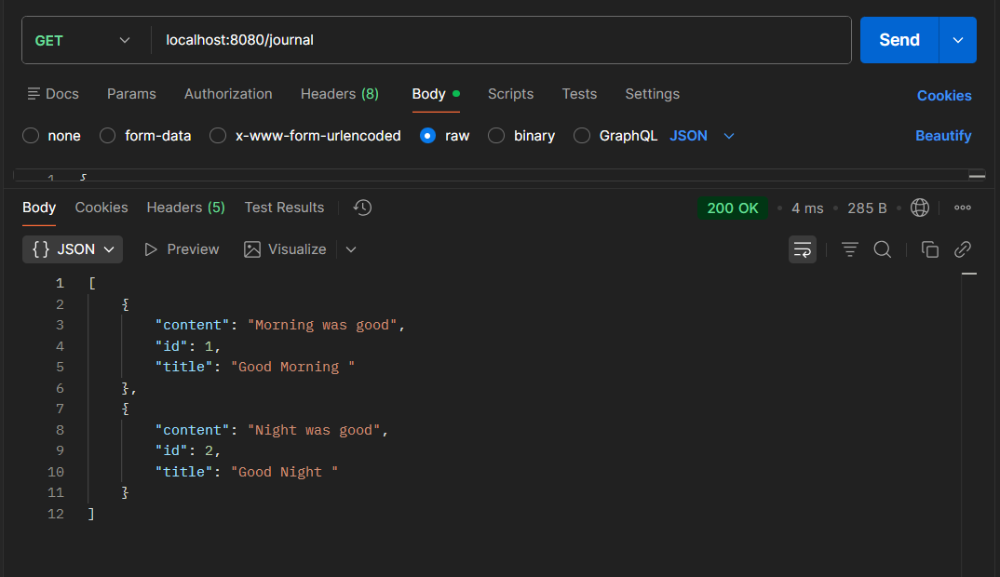

# JournalApp
A simple RESTful Journal application built using Spring Boot that supports CRUD operations using in-memory storage.

---

## 📂 Files
- `JournalAppApplication.java`
- `HealthCheck.java`
- `JournalEntryController.java`
- `JournalEntry.java`

---

## 🧠 Concept Used
- Spring Boot REST API
- @RestController & @RequestMapping
- HTTP Methods (GET, POST, PUT, DELETE)
- @PathVariable & @RequestBody
- In-memory data storage using HashMap
- JSON request/response handling

---

## 📸 Screenshot
  
  
  
  

---

## 👨‍💻 Author
**Sujal Patil**

  
  

