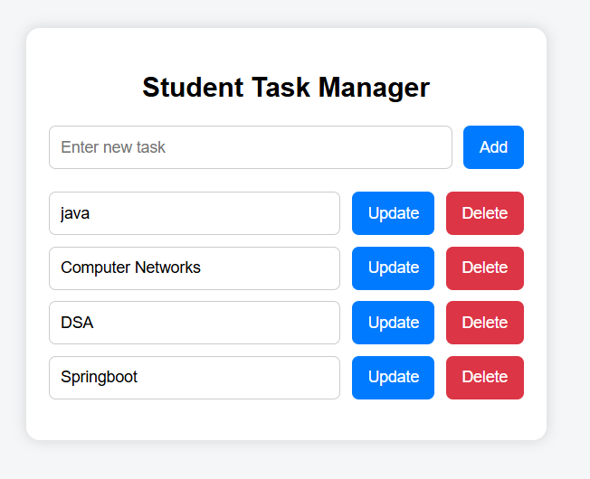

# Student Task Manager – Full Stack Website

A simple full-stack productivity web application where users can add, view, and delete daily tasks using a Spring Boot REST API and a clean HTML, CSS, and JavaScript frontend.

---

## 🚀 Features

- Add new tasks  
- View all tasks  
- Delete tasks  
- REST API backend  
- Clean frontend UI  
- In-memory storage (no database)

---

## 🛠 Tech Stack

### Backend
- Java  
- Spring Boot  
- Spring Web (REST API)

### Frontend
- HTML  
- CSS  
- JavaScript (Fetch API)

---

## 🔗 API Endpoints

| Method | Endpoint | Description |
|--------|----------|-------------|
| GET | `/api/tasks` | Fetch all tasks |
| POST | `/api/tasks` | Add new task |
| DELETE | `/api/tasks/{id}` | Delete task |

---

## 🧠 Concepts Used

- REST API Architecture  
- Controller–Service Pattern  
- JSON Serialization & Deserialization  
- HTTP Methods (GET, POST, DELETE)  
- Fetch API  
- CORS Handling  
- In-Memory Data Storage  
- Frontend–Backend Integration  

---

## 📸 Screenshot

---

## 👨‍💻 Author

**Sujal Patil**

  
  

